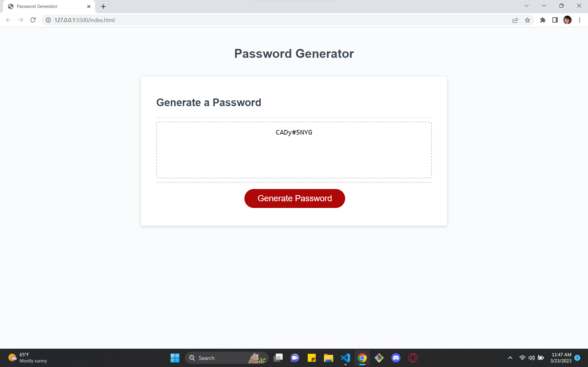

# challenge-3

## Description

- What was your motivation?
 Learning the basics of Javascript and how the background of a website works.
- Why did you build this project? 
 We did this challange with the intent of developing a website that can generate random passwords with spesific characters sybols and numbers.
- What did you learn?
I learned that javascript is the lenguage that makes websites and apps more interactive.

